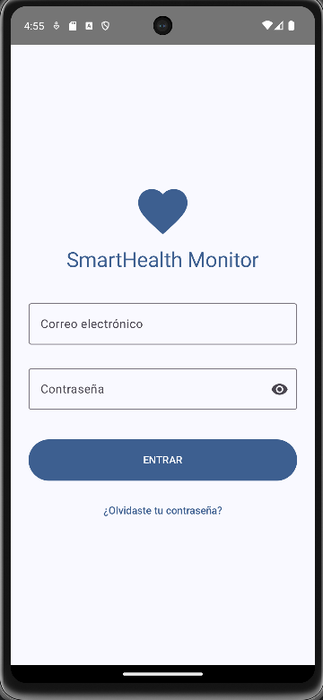
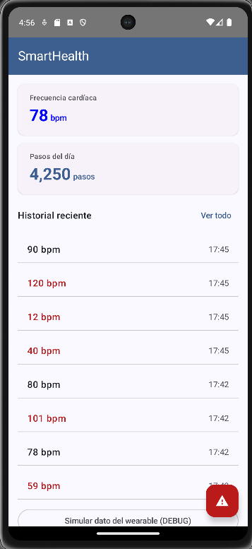
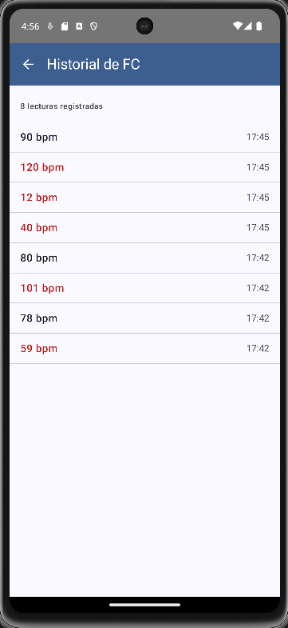
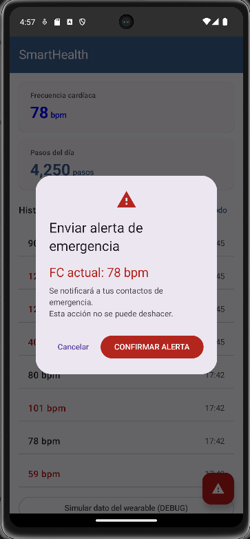
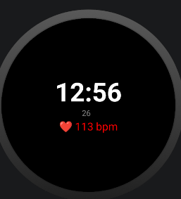
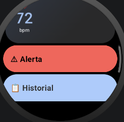

# SmartHealth Monitor


 
Aplicación Android de monitoreo de salud personal en tiempo real.
Desarrollada como proyecto integrador — UTNG 9° Cuatrimestre 2025.
 
## Stack tecnológico
| Tecnología | Uso |
|---|---|
| Kotlin + Jetpack Compose | UI declarativa con Material Design 3 |
| Wearable Data Layer API  | Comunicación reloj ↔ teléfono (BLE) |
| Health Services API     | Sensor FC real en background (Wear OS) |
| Room Database           | Historial persistente de lecturas FC |
| Jetpack Navigation      | NavHost entre 4 pantallas |
| GitHub + Conventional Commits | Control de versiones profesional |
 
## Pantallas
| Pantalla | Descripción |
|---|---|
| LoginScreen | Autenticación con validación y State |
| DashboardScreen | FC y Pasos en tiempo real del wearable |
| HistorialScreen | Lecturas persistidas en Room con Flow reactivo |
| AlertaScreen | AlertDialog MD3 + Snackbar de confirmación |
 
## Capturas de pantalla




 
## Unidad II — Wear OS
| Pantalla | Descripción |
|---|---|
| WearDashboardScreen | FC en tiempo real con ScalingLazyColumn y TimeText |
| WearHistorialScreen | Lista con Rotary Input (corona del reloj) |
| WearAlertaScreen    | Botones circulares de confirmación |
| SmartHealth WatchFace | Hora + FC en el WatchFace nativo |
 



## SmartHealth Monitor — Arquitectura completa
 
```text
Sensor FC (PPG)
    ↓ Health Services API
Wear OS (reloj) — WearDashboardScreen
    ↓ BLE MessageClient (Wearable Data Layer)
Android (teléfono) — Dashboard + Historial + Alerta
    ├── Room DB (SQLite) — historial persistente
    ├── StateFlow → DashboardViewModel → Compose UI
    └── CastManager → Chromecast / Smart TV
         ↓ Cast SDK (WiFi)
TV (Chromecast/Android TV)
    ├── App nativa (Leanback): BrowseFragment + DetailFragment + ExoPlayer
    └── Cast Receiver: datos FC en tiempo real
```
 
## Historial de versiones
| Tag | Descripción |
|-----|-------------|
| v1.0.0 | Unidad I: Android teléfono completo |
| v1.1.0 | Wear OS básico |
| v1.2.0 | Wear OS avanzado + WatchFace |
| v2.0.0 | Android TV Leanback |
| v2.1.0 | TV Detail + Media3/ExoPlayer |
| v2.2.0 | Cast SDK + integración completa |

## Autor
Nombre Apellido — UTNG — Ing. en Desarrollo y Gestión de Software
